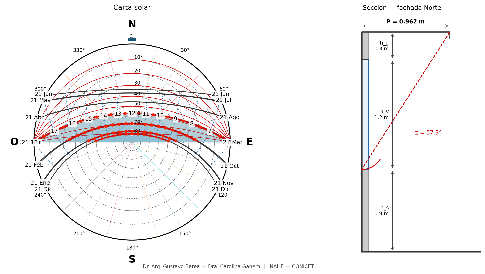
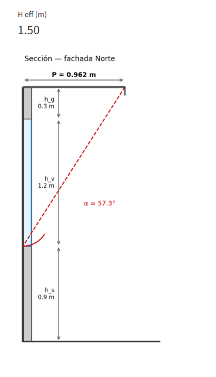

# Carta Solar — Aleros Norte

[](https://doi.org/10.5281/zenodo.20725119)
[](LICENSE)

Herramienta de código abierto para generar **cartas solares estereográficas** (transportador SOL-AR) y dimensionar **aleros horizontales en fachada norte** a partir del período crítico de insolación y medidas en corte vertical. Incluye interfaz de escritorio (tkinter) y versión web (Streamlit).

| Campo | Valor |
| --- | --- |
| **Nombre** | Carta Solar — Aleros Norte |
| **Versión actual** | 1.0.2 |
| **Autores** | Gustavo Barea y Carolina Ganem |
| **Institución** | INAHE-CONICET |
| **Licencia** | [MIT](LICENSE) |
| **DOI Zenodo** | [10.5281/zenodo.20725119](https://doi.org/10.5281/zenodo.20725119) |

**Repositorio de desarrollo:** [github.com/gbarea-INAHE/carta-solar](https://github.com/gbarea-INAHE/carta-solar)

## Capturas de pantalla

_Carta solar estereográfica con trayectorias, transportador y período crítico resaltado:_



_Diagrama en sección de fachada norte con alero, ventana y ángulo α:_



> Las imágenes anteriores son placeholders. Reemplazalas por capturas reales siguiendo [docs/README.md](docs/README.md).

## App web (Streamlit)

Versión en navegador, sin instalar Python:

**URL app web:** _pendiente — desplegar en [Streamlit Cloud](https://share.streamlit.io) (ver [DEPLOYMENT.md](DEPLOYMENT.md))_

```bash
pip install -r requirements.txt
streamlit run streamlit_app.py
```

## App de escritorio (tkinter)

```bash
pip install -r requirements.txt
python app.py
```

## Cómo citar

Si utilizás este software en trabajos académicos, informes o publicaciones indexadas, citá la versión archivada en Zenodo (no solo el repositorio de GitHub).

**APA (7.ª ed.)**

> Barea, G., & Ganem, C. (2026). *Carta Solar — Aleros Norte* (Version 1.0.2) [Software]. Zenodo. https://doi.org/10.5281/zenodo.20725119

**BibTeX**

```bibtex
@software{barea2026carta_solar,
  author       = {Barea, Gustavo and Ganem, Carolina},
  title        = {Carta Solar --- Aleros Norte},
  year         = {2026},
  publisher    = {Zenodo},
  version      = {1.0.2},
  doi          = {10.5281/zenodo.20725119},
  url          = {https://doi.org/10.5281/zenodo.20725119}
}
```

Metadatos adicionales en [CITATION.cff](CITATION.cff). Historial de versiones en [CHANGELOG.md](CHANGELOG.md).

## Requisitos

- Python 3.10+
- Dependencias en `requirements.txt`

## Flujo de trabajo (dimensionamiento de alero norte)

1. Ingresá **latitud** y las **medidas en corte vertical**:
   - **Antepecho** `h_s`: piso → inicio de ventana
   - **Altura ventana** `h_v`
   - **Vano** `h_g`: cierre superior de ventana → inicio del alero
2. Elegí meses y horas del **período crítico** (verano).
3. Pulsá **Calcular alero**: el programa toma **α = altitud solar mínima al mediodía** entre los meses seleccionados (donde las trayectorias cortan los círculos en el eje Norte) y calcula **P = (h_v + h_g) / tan(α)**.
4. Revisá el **informe de cobertura**, la carta con transportador y el **diagrama en sección**.
5. Guardá o descargá PNG/PDF.

El antepecho `h_s` solo se usa en el dibujo en sección; no entra en el cálculo de α ni de P.

## Publicación (GitHub, Zenodo, web)

Instrucciones completas en **[DEPLOYMENT.md](DEPLOYMENT.md)**:

1. Push a GitHub público
2. Release en GitHub → archivo persistente y DOI en Zenodo ([10.5281/zenodo.20725119](https://doi.org/10.5281/zenodo.20725119))
3. Deploy gratuito en [Streamlit Cloud](https://share.streamlit.io)

## Tests

```bash
python -m pytest tests/ -v
```

## Estructura

```
carta_solar/      # núcleo: cálculos, transportador, carta, alero
app.py            # GUI tkinter (escritorio)
streamlit_app.py  # GUI web (Streamlit)
docs/             # capturas de pantalla y documentación visual
assets/           # logos opcionales
tests/
CHANGELOG.md      # historial de versiones
DEPLOYMENT.md     # guía Zenodo + Streamlit Cloud
CITATION.cff      # metadatos de citación
LICENSE           # MIT
```

### Logos (opcional)

Colocá en `assets/`:

- `logo_inahe.png`
- `logo_conicet.png`

## Licencia

MIT — ver [LICENSE](LICENSE).
