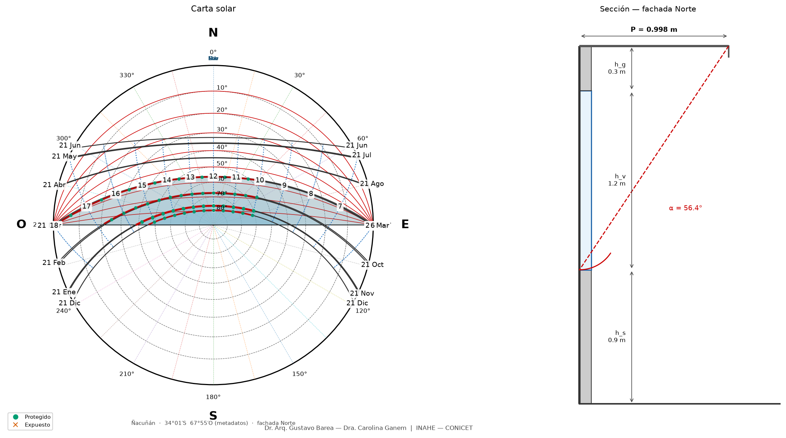
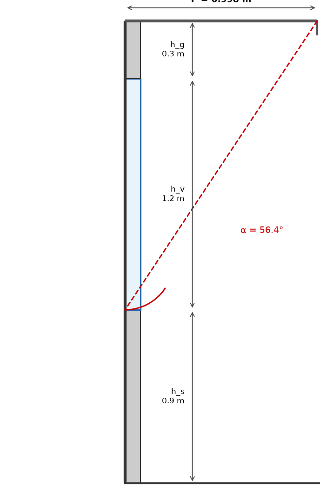

# Carta Solar — Parasoles

[](https://doi.org/10.5281/zenodo.20725118)
[](https://github.com/gbarea-INAHE/carta-solar/actions/workflows/ci.yml)
[](LICENSE)

Herramienta de código abierto para generar **cartas solares estereográficas** (transportador SOL-AR) y dimensionar **dispositivos de sombreado** según orientación de fachada:

- **Alero horizontal** a cualquier azimut (α = mín. ángulo de perfil ε)
- **Parasol vertical** / aletas (β = percentil de |γ|, estilo SOL-AR; profundidad D)

Incluye interfaz web (Streamlit) y de escritorio (tkinter; alero).

| Campo | Valor |
| --- | --- |
| **Nombre** | Carta Solar — Parasoles |
| **Versión actual** | 1.2.2 |
| **Autores** | Gustavo Barea y Carolina Ganem |
| **Institución** | INAHE-CONICET |
| **Licencia** | [MIT](LICENSE) |
| **DOI Zenodo (concepto)** | [10.5281/zenodo.20725118](https://doi.org/10.5281/zenodo.20725118) |
| **DOI Zenodo (v1.2.0)** | [10.5281/zenodo.23050230](https://doi.org/10.5281/zenodo.23050230) |

**Repositorio:** [github.com/gbarea-INAHE/carta-solar](https://github.com/gbarea-INAHE/carta-solar)

## Capturas de pantalla





## App web (Streamlit)

**App en línea:** [carta-solar.streamlit.app](https://carta-solar.streamlit.app/)

```bash
pip install -r requirements.txt
streamlit run streamlit_app.py
```

## App de escritorio (tkinter)

Flujo de alero horizontal (el modo aletas está en la web):

```bash
pip install -r requirements.txt
python app.py
```

## Cómo citar

> Barea, G., & Ganem, C. (2026). *Carta Solar — Parasoles* (Version 1.2.0) [Software]. Zenodo. https://doi.org/10.5281/zenodo.23050230

```bibtex
@software{barea2026carta_solar,
  author       = {Barea, Gustavo and Ganem, Carolina},
  title        = {Carta Solar --- Parasoles},
  year         = {2026},
  publisher    = {Zenodo},
  version      = {1.2.0},
  doi          = {10.5281/zenodo.23050230},
  url          = {https://doi.org/10.5281/zenodo.23050230}
}
```

## Requisitos

- Python 3.11+
- Dependencias en `requirements.txt`

## Flujo de trabajo

1. Elegí **modo**: alero horizontal o parasol vertical.
2. Definí **azimut de fachada** (presets N/E/S/O o personalizado). En E/O la app sugiere aletas.
3. Ingresá medidas (corte para alero; ancho de vano para aletas) y período crítico.
4. Revisá métricas (α/P o β/D), carta e informe de cobertura.
5. Exportá PNG (en la web: vista previa rápida + PNG 300 dpi bajo demanda).

**Notas bioclimáticas:** el alero horizontal es eficaz cuando el sol crítico está alto frente a la fachada (típico N/S). En Este/Oeste el sol bajo matutino/vespertino se controla mejor con **parasoles verticales**. El β automático usa el percentil P25 de |γ| (no el mínimo), alinea con el transferidor SOL-AR/LabEEE y avisa cuando hay mucho sol frontal. Horas civiles usan longitud + huso UTC + ecuación del tiempo.

**Próximamente:** louvres horizontales y obstrucciones del entorno.

## Tests

```bash
python -m pytest tests/ -v
```

## Estructura

```
carta_solar/           # núcleo solar, máscaras, plot
carta_solar/devices/   # alero y parasol vertical
app.py                 # GUI tkinter
streamlit_app.py       # GUI web (modos + azimut)
tests/
```

## Licencia

MIT — ver [LICENSE](LICENSE).
